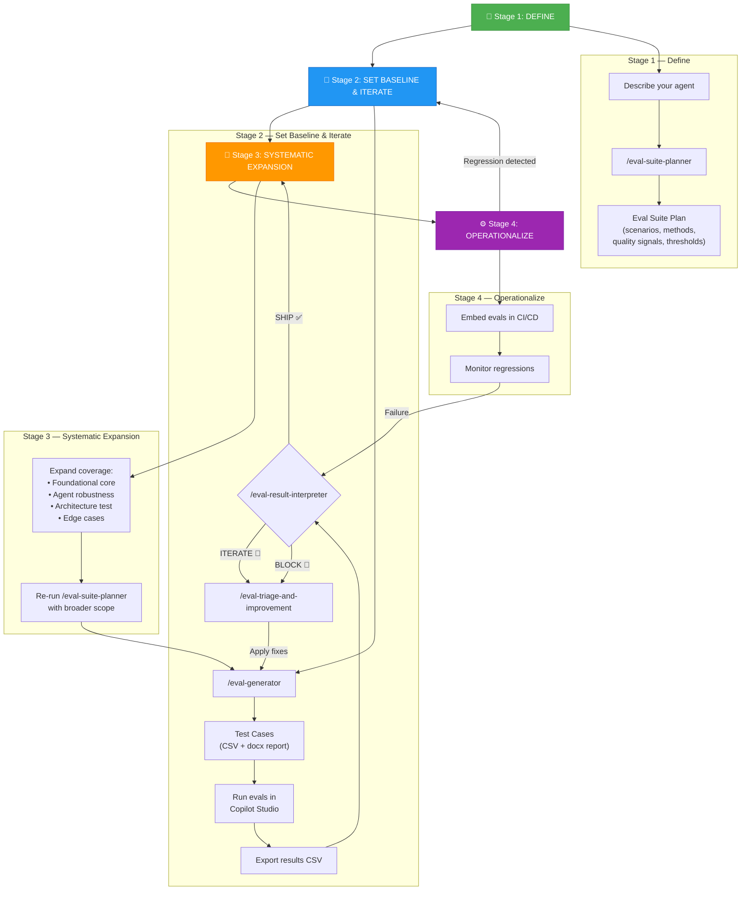

# 🧪 AI Eval Skills

A curated collection of AI agent evaluation skills from [Microsoft's Eval Guide](https://github.com/microsoft/eval-guide), packaged for use with GitHub Copilot, Claude Code, Cursor, and other AI coding agents via the [Skills CLI](https://skills.sh).

These skills implement Microsoft's **4-stage evaluation framework** for Copilot Studio agents — helping you plan, generate, run, and interpret evaluation test suites with structured, repeatable methodology.

---

## 📋 Included Skills

| Skill | Purpose | Stage |
|-------|---------|-------|
| **eval-suite-planner** | Produces a concrete eval suite plan — scenario types, methods, quality signals, thresholds | Stage 1: Define |
| **eval-generator** | Generates eval test cases from a plan or agent description (single-response & multi-turn) | Stage 2: Set Baseline |
| **eval-result-interpreter** | Analyzes eval CSV results → SHIP / ITERATE / BLOCK verdict with root cause triage | Stages 2–4: Interpret |
| **eval-triage-and-improvement** | Interactive diagnosis and remediation for failing eval cases | Stages 2–4: Improve |
| **find-skills** | Discovers and installs additional skills from the open ecosystem | Utility |

---

## 🔄 Evaluation Lifecycle Workflow

The skills follow Microsoft's **4-stage iterative evaluation framework**. Here's how they connect:



### Simplified Quick-Reference

```
 ┌─────────────────┐     ┌──────────────────┐     ┌───────────────┐     ┌──────────────────────┐
 │  1. PLAN         │────▶│  2. GENERATE      │────▶│  3. RUN       │────▶│  4. INTERPRET        │
 │                  │     │                   │     │               │     │                      │
 │ /eval-suite-     │     │ /eval-generator   │     │ Copilot       │     │ /eval-result-        │
 │  planner         │     │                   │     │ Studio        │     │  interpreter         │
 └─────────────────┘     └──────────────────┘     └───────────────┘     └──────────┬───────────┘
                                   ▲                                               │
                                   │         ┌──────────────────────┐              │
                                   └─────────│  5. FIX & RETRY      │◀─────────────┘
                                             │                      │   (if ITERATE/BLOCK)
                                             │ /eval-triage-and-    │
                                             │  improvement         │
                                             └──────────────────────┘
```

---

## 🚀 Installation

### Using the Skills CLI (recommended)

```bash
npx skills add varunk130/AI-Eval-Skills
```

### Manual installation

Clone this repo and copy the `skills/` folder into your project's `.agents/skills/` directory.

---

## 🛠️ Usage

Once installed, invoke the skills in any supported AI agent:

```
# Step 1 — Plan your eval suite
/eval-suite-planner My agent answers HR policy questions using a SharePoint knowledge base

# Step 2 — Generate test cases from the plan
/eval-generator

# Step 3 — Run evals in Copilot Studio, export CSV

# Step 4 — Interpret results
/eval-result-interpreter <paste CSV or attach file>

# Step 5 — Get interactive help fixing failures
/eval-triage-and-improvement
```

---

## 📖 Skill Details

### `/eval-suite-planner`
**Input:** Plain-English agent description  
**Output:** Scenario table with evaluation methods, quality signals, acceptance criteria, and priority order  
**Grounded in:** Microsoft Eval Scenario Library (29 business-problem + 49 capability sub-scenarios), MS Learn evaluation docs, evaluation checklist

### `/eval-generator`
**Input:** Eval suite plan (from planner) or agent description  
**Output:** Test cases table, importable CSV, and docx report  
**Supports:** Single-response and conversation (multi-turn) evaluation modes

### `/eval-result-interpreter`
**Input:** Copilot Studio evaluation CSV, pasted summary, or description  
**Output:** SHIP/ITERATE/BLOCK verdict, root cause classification, diagnostic triage, prioritized remediation  
**Grounded in:** Microsoft's Triage & Improvement Playbook (4-layer triage, 3 root cause types, 26 diagnostic questions)

### `/eval-triage-and-improvement`
**Input:** Eval results with failing test cases  
**Output:** Interactive step-by-step diagnosis, remediation steps, pattern analysis  
**Best for:** Ongoing improvement loops with 15+ failures

### `/find-skills`
**Input:** Natural language query  
**Output:** Skill recommendations from the open ecosystem

---

## 📚 References

- [Microsoft Eval Guide](https://github.com/microsoft/eval-guide) — Source repository
- [MS Learn: Agent Evaluation Framework](https://learn.microsoft.com/en-us/microsoft-copilot-studio/guidance/evaluation-checklist) — 4-stage checklist
- [Eval Scenario Library](https://github.com/microsoft/ai-agent-eval-scenario-library) — Scenario types and quality signals
- [Triage & Improvement Playbook](https://github.com/microsoft/triage-and-improvement-playbook) — Root cause framework
- [Evaluation Checklist Template](https://github.com/microsoft/PowerPnPGuidanceHub/tree/main/guidance/agentevalguidancekit) — Editable tracking template

---

## 🤝 Contributing

Feel free to open issues or PRs to improve skill configurations, add examples, or expand documentation.

## 📄 License

These skills are sourced from [microsoft/eval-guide](https://github.com/microsoft/eval-guide). Please refer to the original repository for licensing terms.
