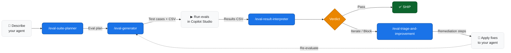

<div align="center">

# 🧪 AI Eval Skills

**A turnkey toolkit for evaluating AI agents — from first test plan to production-grade CI/CD pipelines.**

Built on [Microsoft's evaluation methodology](https://learn.microsoft.com/en-us/microsoft-copilot-studio/guidance/evaluation-checklist), packaged as drop-in skills for GitHub Copilot, Claude Code, Cursor, and 10+ other AI coding agents.

[](https://skills.sh)
[](https://github.com/microsoft/eval-guide)
[](LICENSE)

</div>

---

## Why This Exists

Shipping an AI agent without structured evaluation is like deploying code without tests — you're flying blind, and you'll only find out what's broken once users hit it. These skills give your coding agent the ability to walk you through the entire eval lifecycle: designing what to test, building the test cases, reading the results, and telling you exactly what to fix. No context-switching, no manual spreadsheet work.

---

## What's Inside

| Skill | What It Does | When To Use It |
|:------|:-------------|:---------------|
| **eval-suite-planner** | Takes a plain-English description of your agent and designs a full evaluation plan — which scenarios to test, which quality signals matter, what pass/fail looks like | You're starting fresh and need to figure out *what* to evaluate |
| **eval-generator** | Turns that plan into ready-to-run test cases with realistic inputs, expected outputs, and scoring criteria. Exports CSV for direct Copilot Studio import | You have a plan (or even just an agent description) and need actual test data |
| **eval-result-interpreter** | Reads your evaluation results and delivers a SHIP / ITERATE / BLOCK verdict with ranked root causes and a prioritized fix list | You've run your evals and need to know: *are we good to go?* |
| **eval-triage-and-improvement** | Walks you through failing test cases interactively — diagnosing why each one broke and recommending specific remediation steps | You have multiple failures and need hands-on help working through them |
| **cost-quality-frontier** | Augments eval results with cost (input + output tokens × model price) and latency (p50/p95), then plots model options on a Pareto frontier with a quality-per-dollar composite score | You're choosing a production model and need quality, cost, and latency on one page |
| **find-skills** | Searches the open skills ecosystem to discover additional capabilities you can install | You want to extend your agent's toolbox beyond eval |

---

## How It All Fits Together



> **Add `cost-quality-frontier` and `tool-use-eval` for production model selection and tool-using agent evaluation respectively.`r`n`r`n> **The loop in one sentence**:** Plan what to test → generate test cases → run them → read the verdict → fix what failed → repeat until you ship.

### Stage Map

Each skill maps to a stage in [Microsoft's 4-stage evaluation framework](https://learn.microsoft.com/en-us/microsoft-copilot-studio/guidance/evaluation-checklist):

```
  DEFINE              BASELINE & ITERATE           EXPAND                OPERATIONALIZE
 ┌──────────┐   ┌──────────────────────────┐   ┌──────────────┐   ┌──────────────────────┐
 │           │   │                          │   │  Broaden     │   │  Embed evals in      │
 │  Plan     │──▶│  Generate → Run → Read   │──▶│  coverage    │──▶│  CI/CD pipeline      │
 │           │   │        ▲         │       │   │  & repeat    │   │  & monitor           │
 │           │   │        └── Fix ──┘       │   │              │   │  regressions         │
 └──────────┘   └──────────────────────────┘   └──────────────┘   └──────────────────────┘
  eval-suite-    eval-generator                  Re-run planner    eval-result-interpreter
  planner        eval-result-interpreter         with broader      (for regression triage)
                 eval-triage-and-improvement     scope
```

---

## Quick Start

### Install

```bash
npx skills add varunk130/AI-Eval-Skills
```

Or clone this repo and copy the contents of `skills/` into your project's `.agents/skills/` directory.

### Use

Run these commands inside any supported AI agent (GitHub Copilot, Claude Code, Cursor, etc.):

```text
# 1. Design your evaluation plan
/eval-suite-planner My agent handles employee onboarding questions using an HR knowledge base and can submit PTO requests via API

# 2. Generate test cases from the plan
/eval-generator

# 3. Run the generated tests in Copilot Studio, then export the results CSV

# 4. Get your verdict
/eval-result-interpreter <paste or attach your results CSV>

# 5. If the verdict isn't SHIP — get interactive help fixing failures
/eval-triage-and-improvement
```

---

## Skill Deep Dives

<details>
<summary><strong>/eval-suite-planner</strong> — Design your evaluation strategy</summary>

**You provide:** A natural-language description of what your agent does  
**You get back:**
- Matched scenario types from Microsoft's library (78 sub-scenarios across business-problem and capability categories)
- Recommended evaluation methods for each scenario
- Quality signals and acceptance thresholds
- A prioritized scenario table ready to hand off to `/eval-generator`

**Best for:** Kicking off a new eval effort, expanding coverage after initial passes, or onboarding a teammate to your eval strategy.
</details>

<details>
<summary><strong>/eval-generator</strong> — Build your test cases</summary>

**You provide:** An eval plan (from `/eval-suite-planner`) or a standalone agent description  
**You get back:**
- One test case per scenario with realistic user inputs and expected agent responses
- Scoring criteria and evaluation method configuration for each case
- A CSV file formatted for direct import into Copilot Studio
- A summary report for human review

**Supports:** Both single-response and multi-turn conversation evaluation modes.
</details>

<details>
<summary><strong>/eval-result-interpreter</strong> — Read your results</summary>

**You provide:** A Copilot Studio evaluation CSV, pasted results, or a plain-English summary  
**You get back:**
- **SHIP / ITERATE / BLOCK** verdict
- Root cause classification for every failure (knowledge gap, orchestration error, or safety issue)
- Diagnostic triage across 4 layers with 26 structured questions
- Prioritized remediation list ranked by impact

**Best for:** First look at results, generating a shareable triage report, or triaging CI/CD regression failures.
</details>

<details>
<summary><strong>/eval-triage-and-improvement</strong> — Fix what's broken</summary>

**You provide:** Eval results with one or more failing test cases  
**You get back:**
- Interactive, step-by-step walkthrough of each failure
- Root cause diagnosis with specific remediation actions
- Pattern analysis across failures to surface systemic issues

**Best for:** Hands-on improvement sessions, especially when you have 15+ failures and need help prioritizing.
</details>

<details>
<summary><strong>/find-skills</strong> — Discover more skills</summary>

**You provide:** A natural-language query ("Is there a skill for load testing?" / "Find deployment skills")  
**You get back:** Matching skills from the open ecosystem with install commands.
</details>

---

## References

| Resource | Description |
|:---------|:------------|
| [microsoft/eval-guide](https://github.com/microsoft/eval-guide) | Original skill source |
| [Agent Evaluation Framework](https://learn.microsoft.com/en-us/microsoft-copilot-studio/guidance/evaluation-checklist) | Microsoft's 4-stage evaluation methodology |
| [Eval Scenario Library](https://github.com/microsoft/ai-agent-eval-scenario-library) | 78 evaluation sub-scenarios with quality signals |
| [Triage & Improvement Playbook](https://github.com/microsoft/triage-and-improvement-playbook) | Root cause classification and remediation framework |
| [Evaluation Checklist Template](https://github.com/microsoft/PowerPnPGuidanceHub/tree/main/guidance/agentevalguidancekit) | Editable tracker for all 4 stages |

---

## Contributing

Issues and PRs welcome — whether it's improving documentation, adding usage examples, or suggesting new eval patterns.

## License

Skills in this repo are sourced from [microsoft/eval-guide](https://github.com/microsoft/eval-guide). See the original repository for licensing terms.

---

<sub>Curated and maintained by [Varun Kulkarni](https://github.com/varunk130) — part of a portfolio of AI agent systems for product teams.</sub>
